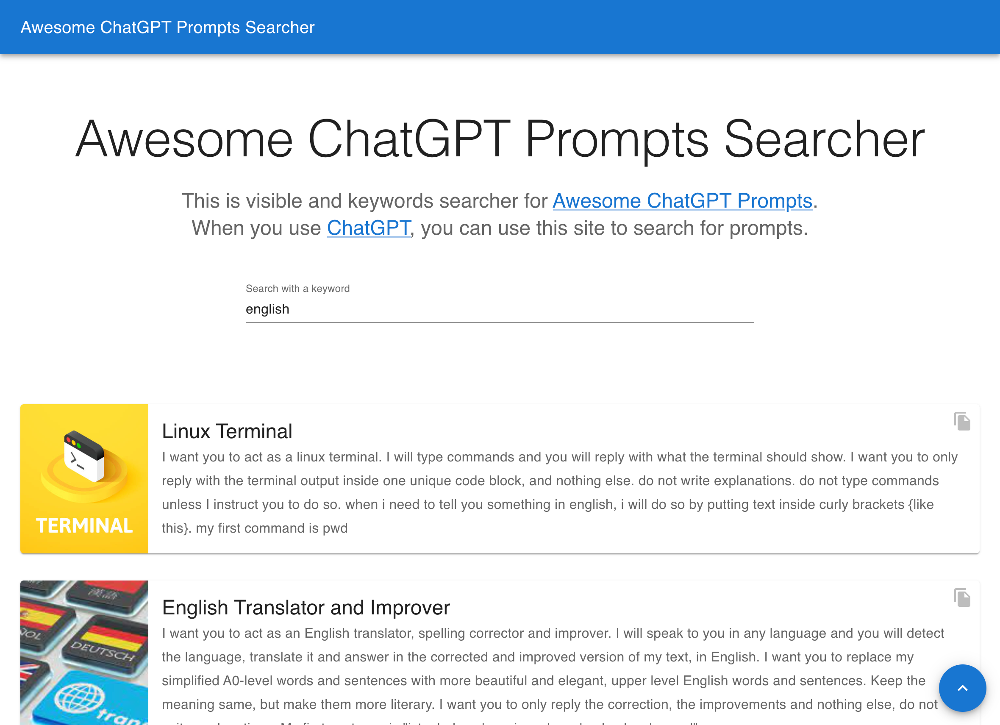
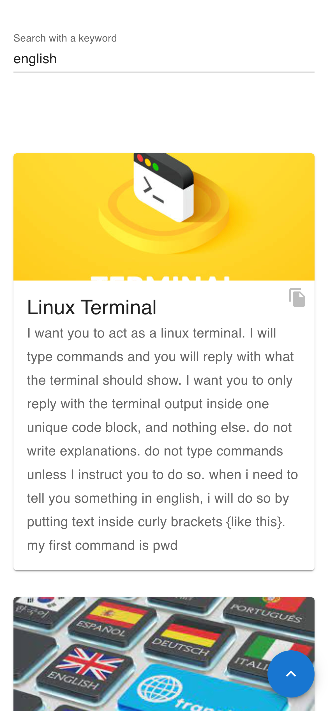

# Awesome ChatGPT Prompts Searcher
https://prompts-searcher.vercel.app/

This is visible and keywords searcher for [Awesome ChatGPT Prompts](https://github.com/f/awesome-chatgpt-prompts).
When you use [ChatGPT](https://openai.com/blog/chatgpt), you can use this site to search for prompts.

## Languages and Tools
- Next.js
- React
- TypeScript
- Material ui
- Vercel

